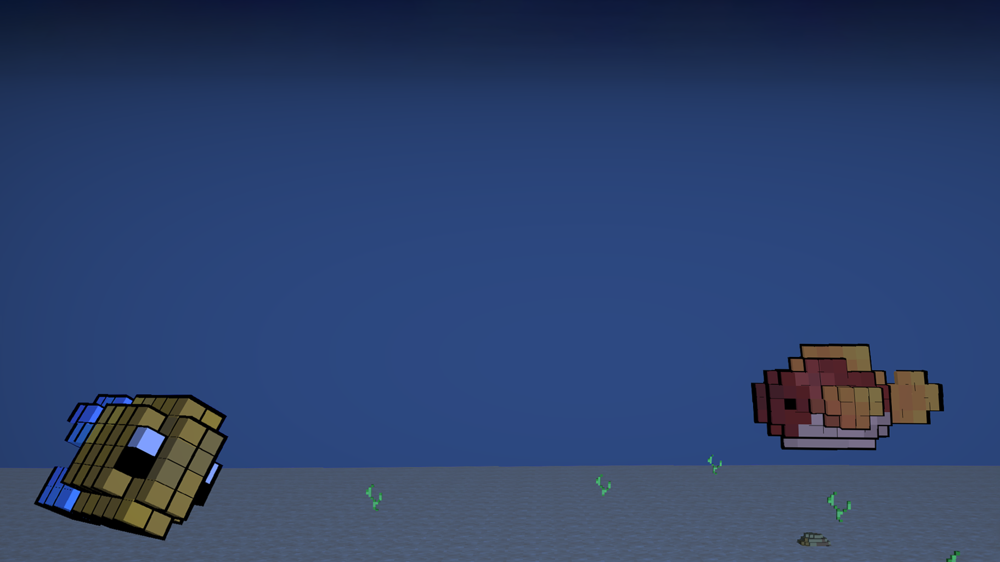
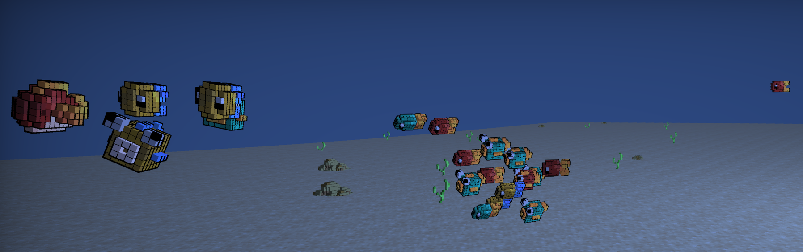
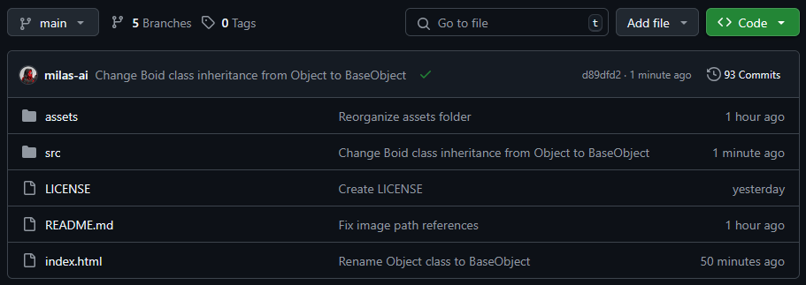
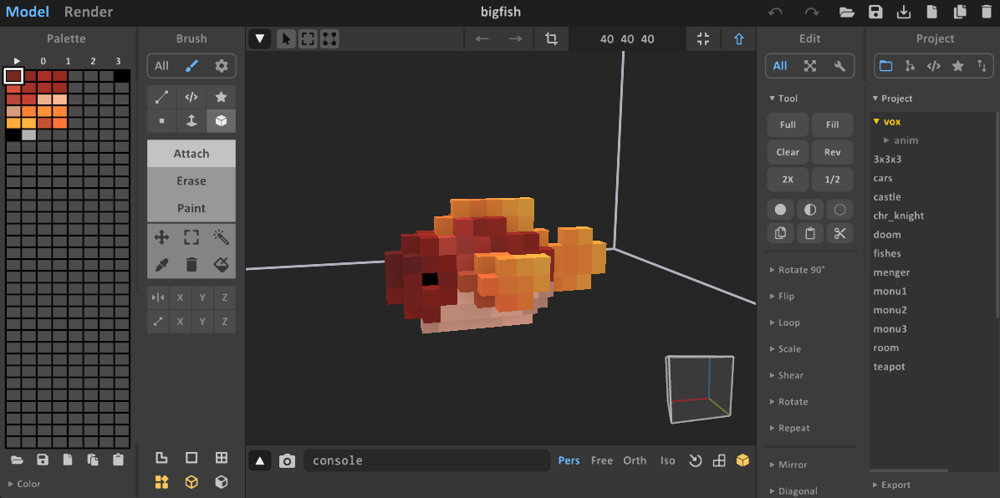
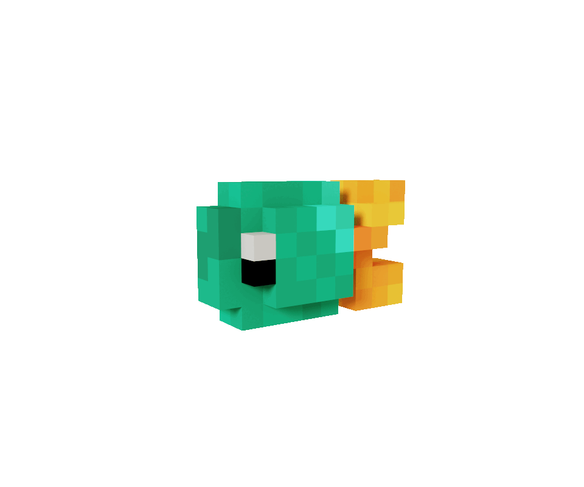
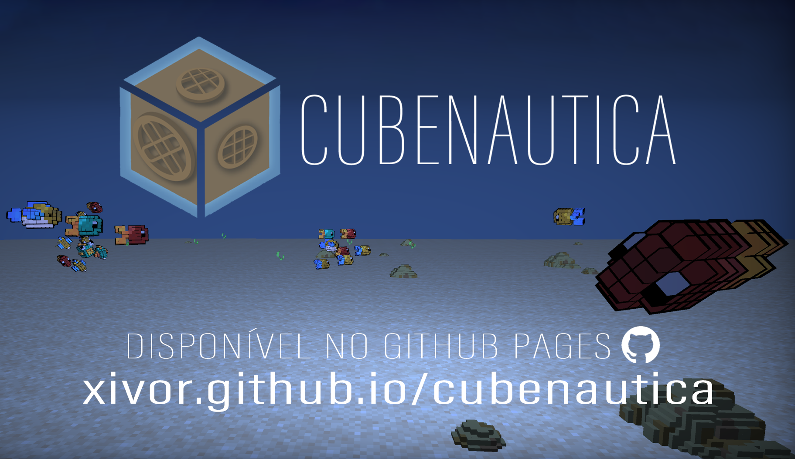

<style>
@import 'https://cdnjs.cloudflare.com/ajax/libs/font-awesome/6.4.0/css/all.min.css';
img {
  	    background-color: transparent!important;
    }
</style>
<!-- _class: lead invert -->



&nbsp;
&nbsp;

---
<!-- _class: lead invert -->
<!-- _backgroundColor: #3a5282 -->
<center>

# <i class="fas fa-file"></i>&nbsp;&nbsp;O que é o Cubenautica?
</center>

<span class="orange">Simulador de mergulho</span> em que você pode explorar um ambiente submarino usando o mouse para controlar a câmera e o teclado para se movimentar.



---
<!-- _class: lead -->
<!-- _color: #39302d -->
<center>

# <i class="fas fa-code-branch"></i>&nbsp;&nbsp;Desenvolvimento
</center>

</div>

<i class="fab fa-square-github"></i> [Github](https://github.com/Xivor/cubenautica) - Versionamento do projeto gerenciado com Git.

&nbsp;

<center>

</center>

---
<!-- _class: invert -->
<!-- _backgroundColor: #3a5282 -->
<center>

# <i class="fas fa-ship"></i>&nbsp;&nbsp;Tripulação
</center>

&nbsp;

<i class="fas fa-code-pull-request"></i>&nbsp;&nbsp;**Diogo Ribeiro**: <span class="orange">Modelos</span> e <span class="orange">Organização</span>

<i class="fas fa-video"></i>&nbsp;&nbsp;**Francisco Henriques**: <span class="orange">Boids</span> e <span class="orange">Pós-processamento</span>

<i class="fas fa-cube"></i>&nbsp;&nbsp;**Luiz Fernando**: <span class="orange">Culling</span> e <span class="orange">Objetos</span>

---
<!-- _class: none -->
<!-- _color: #39302d -->
<center>

# <i class="fas fa-fish-fins"></i>&nbsp;&nbsp;Modelos
</center>

- **MagicaVoxel**: editor de arte voxel leve e gratuito;

- Modelos exportados como uma <span class="blue">lista de cubos</span> em arquivos `.ply`
(Polygon File Format).
<div style="text-align: center; display: flex; justify-content: center; align-items: center; padding: -10; margin: -10;">


</div>


---
<!-- _class: invert -->
<!-- _backgroundColor: #3a5282 -->
<center>

# <i class="fas fa-cube"></i>&nbsp;&nbsp;Objetos
</center>

- Arquivos dos modelos são processados e transformados em <span class="orange">lista de voxels</span>;

- Para cada voxel, se houver <span class="orange">voxels adjascentes a todas as suas faces</span>, ele é excluido da lista;

- Classe `BaseObject` construi o objeto a partir dessas listas e depois aplica as transformações usuais para **afetar todos os voxels** simultaneamente.

---
<!-- _class: none -->
<!-- _color: #39302d -->
<center>

# <i class="fas fa-object-group"></i>&nbsp;&nbsp;Culling
</center>

- **Otimização**: renderiza apenas o que a câmera vê;

- Culling da API do WebGL foi usado para não renderizar as faces de cada voxel que não estejam viradas para a câmera;

- Implementamos “<span class="blue">**culling global**</span>”: objeto só é renderizado se está dentro do frustum de visão da câmera.

---
<!-- _class: invert -->
<!-- _backgroundColor: #3a5282 -->
<center>

# <i class="fas fa-cogs"></i>&nbsp;&nbsp;Boids
</center>

- Comportamento realista de <span class="orange">cardumes / revoadas</span>;

- **3 componentes**: coesão - separação - alinhamento;

- Cada elemento do boid é responsável por se ajustar em relação aos outros.

```js
class Boid extends BaseObject {
    constructor(position, rotation, scale, shader, model)
    update(delta, boids)
    updateRotation()
    applyBoundaries()
    separate(boids)
    align(boids) 
    cohere(boids)
}
```
---
<!-- _class: none -->
<!-- _color: #39302d -->
<center>

# <i class="fas fa-video"></i>&nbsp;&nbsp;Pós-processamento
</center>

- Efeitos adicionados sobre a cena já renderizada;

- Render em um `FramebufferObject` -> render do `FrameBufferObject` no canvas;

- Shader de post processing simula <span class="blue">ambiente aquático</span>.

&nbsp;
&nbsp;


---
<!-- Demonstação -->
<!-- _class: invert -->
<!-- _backgroundColor: #3a5282 -->
<a href="https://xivor.github.io/cubenautica/" target="_blank">
    
</a>